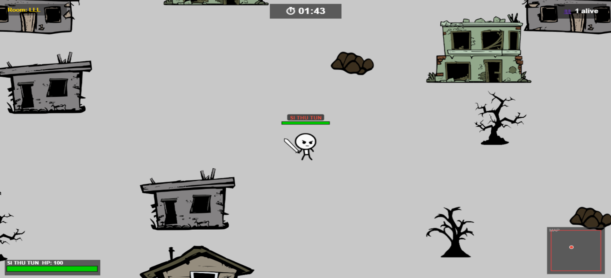
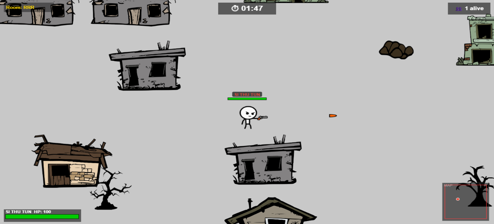
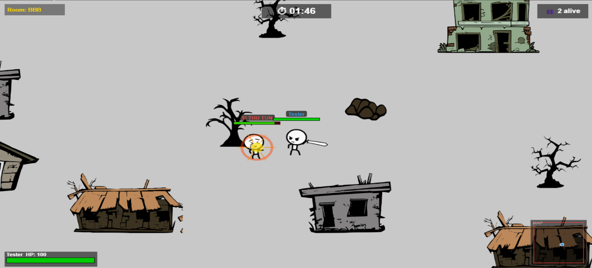

# ⚔ JS Arena

**A browser-based online multiplayer stickman battle royale game.**  
**ブラウザで遊べるオンラインマルチプレイヤー スティックマン バトルロワイヤルゲーム。**

---

## 📸 Screenshots / スクリーンショット





---

## 🎮 How to Play / 遊び方

### Controls / 操作方法

| Key / キー | Action / アクション |
|---|---|
| `W A S D` | Move / 移動 |
| `J` | Attack / 攻撃 |
| `E` | Switch Weapon / 武器切替 |
| `Space` | Dash / ダッシュ |
| `N` | Slide / スライド |

### Weapons / 武器

| Weapon / 武器 | Damage / ダメージ | Range / 射程 |
|---|---|---|
| Fist / こぶし | 4 | Short / 短い |
| Sword / 剣 | 12 | Medium / 中程度 |
| Pistol / ピストル | 8 | Long / 長い |

### Rules / ルール
- The safe zone border shrinks over 2 minutes. Stay inside or lose HP!  
  安全ゾーンは2分間で縮小します。外に出るとHPが減ります！
- Kill a player to restore **30 HP**.  
  プレイヤーを倒すと**30HP**回復します。
- Last player standing wins!  
  最後の生き残りが勝者です！

---

## 🚀 How to Run / 実行方法

### Requirements / 必要なもの
- [Node.js](https://nodejs.org/) v18+
- [ngrok](https://ngrok.com/) (for playing over the internet / インターネット経由でプレイする場合)

### Steps / 手順

**1. Install dependencies / 依存関係をインストール**
```bash
cd "JS Arena"
npm install
```

**2. Start the server / サーバーを起動**
```bash
node server.js
```

**3. (Optional) Share over internet with ngrok / インターネット共有する場合**
```bash
ngrok http 3000
```

**4. Open in browser / ブラウザで開く**
```
http://localhost:3000
```
Or share the ngrok URL with friends!  
または ngrok の URL を友達に共有！

---

## 🏠 Playing on the Same WiFi / 同じWiFiでプレイ

Find your local IP with `ipconfig` and share:
```
http://YOUR_LOCAL_IP:3000
```
Everyone on the same WiFi can connect directly — faster and no lag!  
同じWiFiなら直接接続できます — 高速でラグなし！

---

## 🎯 Features / 特徴

- ✅ Online multiplayer up to 30 players / 最大30人のオンラインマルチプレイ
- ✅ Room code system (3-letter codes like AAA) / ルームコードシステム
- ✅ Shrinking border / 縮小するボーダー
- ✅ 3 weapons: Fist, Sword, Pistol / 3種類の武器
- ✅ Kill feed & kill counter / キルフィード & キルカウンター
- ✅ Minimap / ミニマップ
- ✅ Player colors / プレイヤーカラー
- ✅ Sound effects / サウンドエフェクト
- ✅ Heal on kill / キルでHP回復
- ✅ Synchronized loading — game starts when all players are ready  
  同期ローディング — 全員準備完了後にゲーム開始

---

## 🛠 Tech Stack / 技術スタック

- **Frontend:** Vanilla JavaScript, HTML5 Canvas
- **Backend:** Node.js, Express
- **Realtime:** Socket.io
- **Assets:** Stick Figure Character Sprites 2D

---

## 👨‍💻 Author / 作者

**Si Thu Tun**  
Made as a JavaScript class project / JavaScriptの授業プロジェクトとして制作

---

*Built with ⚔ and JavaScript*
